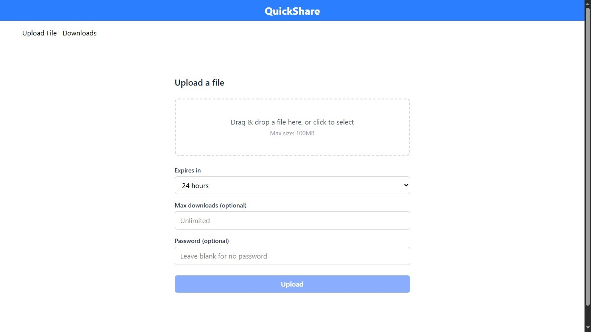
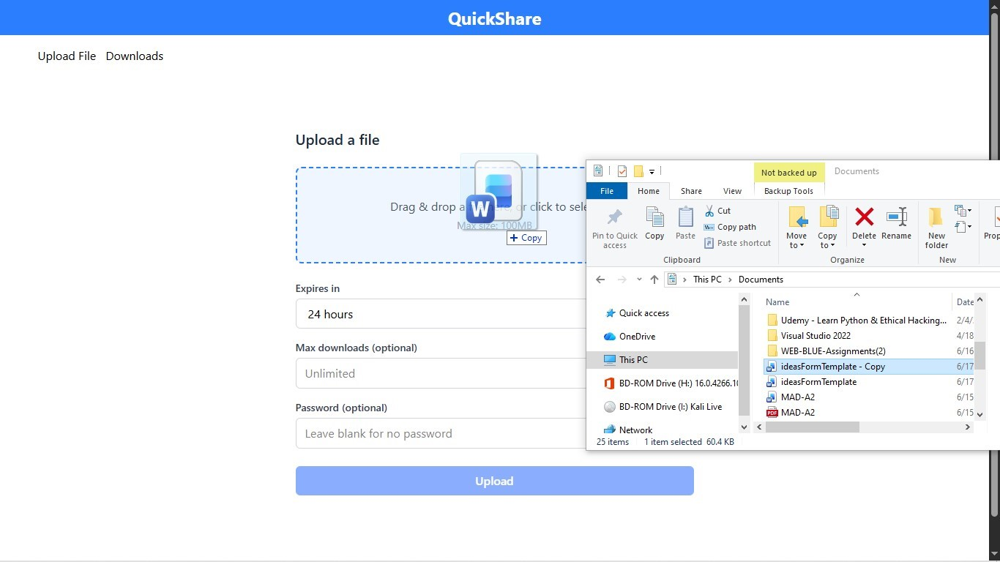
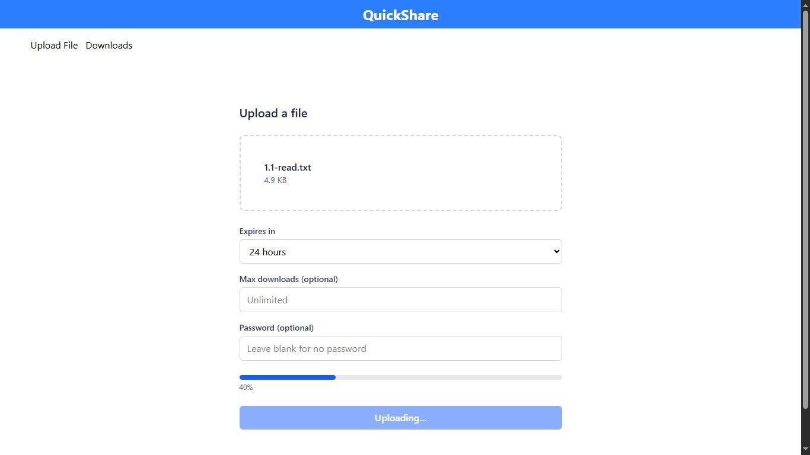
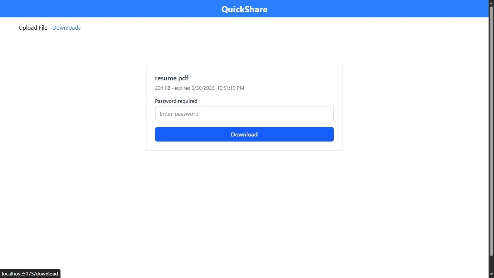
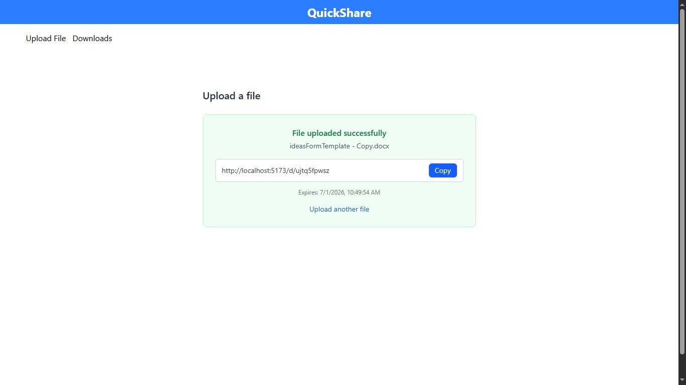
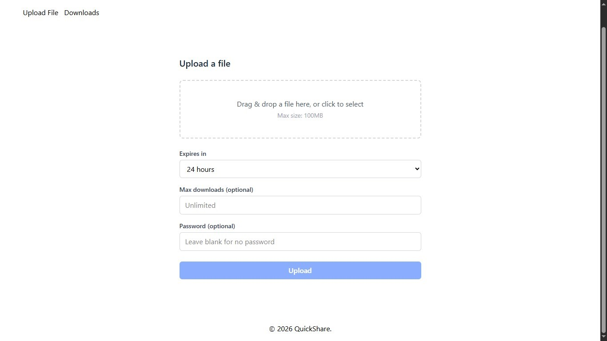

# QuickShare

QuickShare is a temporary file sharing platform that enables users to upload files and share them via a
time-limited, token-based link. The recipient opens the link, optionally enters a password, previews the
file if it is a PDF or image, and downloads it. Files expire automatically either after a set duration or after
a maximum number of downloads, whichever limit is reached first.
Project Title: QuickShare (Temporary File Sharing Platform)
Technology Stack: Vue (Composition API), Vue Router, Tailwind CSS, Vite

---

## Problem Statement

Existing file sharing tools either require both parties to have accounts (Google Drive, Dropbox) or offer
limited control over file lifespan and access restrictions (WeTransfer free tier). QuickShare addresses this
gap by providing anonymous, no-account file sharing with configurable expiry by time, configurable expiry
by download count, and optional password protection, all accessible via a single shareable link.

---

## System Overview

The client-side application consists of two primary routes and a shared layout, decomposed into six
focused Vue components. The diagram below represents the full component hierarchy as implemented.

---

## Architecture Tree

```text
src
├── components
│   ├── FileDropzone.vue
│   ├── UploadOptions.vue
│   ├── UploadResult.vue
│   ├── Navbar.vue
│   ├── Footer.vue
│   └── AppLayout.vue
│
├── views
│   ├── UploadPage.vue
│   └── DownloadPage.vue
│
├── router
│   └── index.js
│
├── App.vue
└── main.js
```

Each component has a single, clearly bounded responsibility. No component manages state that belongs
to another; all shared state is owned by the nearest common ancestor (UploadPage.vue for the upload
flow), following the Vue principle of lifting state up.

---

## Single Page Application Routing

Vue Router is configured with two named routes. Navigation never triggers a full page reload; the router
intercepts the URL change and swaps the active component inside <RouterView> in the layout wrapper.

### Routes

| Route       | Description   |
| ----------- | ------------- |
| `/`         | Upload Page   |
| `/d/:token` | Download Page |

### Router Configuration

```javascript
import { createRouter, createWebHistory } from "vue-router";

import UploadPage from "../views/UploadPage.vue";
import DownloadPage from "../views/DownloadPage.vue";

const routes = [
  {
    path: "/",
    component: UploadPage,
  },
  {
    path: "/d/:token",
    component: DownloadPage,
  },
];

const router = createRouter({
  history: createWebHistory(),
  routes,
});

export default router;
```

```javascript
(
  <RouterLink class="hover:text-blue-500" to="/">
    Upload File
  </RouterLink>
) & nbsp;
<RouterLink class="hover:text-blue-500" to="/d/:token">
  Downloads
</RouterLink>;
```

The `:token` parameter represents the unique download token generated after a successful upload.

---

# 🧩 Modular Component Architecture

The interface is divided into reusable Vue components.

## Components

- FileDropzone
- UploadOptions
- UploadResult
- Navbar
- Footer
- AppLayout

## Views

- UploadPage
- DownloadPage

This architecture improves:

- Reusability
- Maintainability
- Scalability
- Easier debugging

---

# 🔄 Inter-Component Communication

The application follows Vue's recommended pattern:

- Parent owns the data.
- Children receive data using **Props**.
- Children communicate changes using **Custom Events ($emit)**.

This creates a **single source of truth** inside `UploadPage.vue`.

### Example

```vue
<!-- Parent -->
<UploadResult :downloadLink="downloadLink" @copy-link="copyLink" />
```

```javascript
// Child

const props = defineProps({
  downloadLink: String,
});

const emit = defineEmits(["copy-link"]);

function copy() {
  emit("copy-link");
}
```

---

## Getting Started

```bash
git clone <repository-url>
cd quickshare
npm install
npm run dev
```

---

# Screenshots

Create a folder named **screenshots** inside the repository and place your images there.

```text
screenshots/
│
├── home-page.png
├── upload-page.png
├── download-page.png
├── success-page.png
└── full-home-page.png
```

Then display them like this:

```markdown
## Home Page



---

## Upload Page




---

## Download Page



---

## Successful Download



---

## Full Home Page


```

---

# 🚀 Getting Started

Clone the repository

```bash
git clone https://github.com/tahirainam/Temporary-File-Transfer-Platform.git
```

Navigate into the project

```bash
cd frontend
```

Install dependencies

```bash
npm install
```

Run the development server

```bash
npm run dev
```

---

## Authors

- Tahira Inam
- Raeesa Riaz

---

## 📄 License

This project was developed for academic purposes as part of the Web Engineering Semester Project.

```

```
